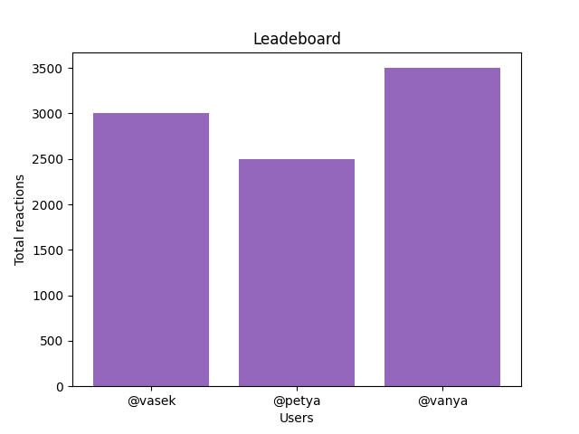

# API for social network v3.0
# Documentation


#### что нового в v3.1:
- Смена postgreSQL на nosql базу данных - MongoDB

###### v3.1 это лишь альтернатива проекту 3.0 версии, тк кроме перехода к другой базе данных ничего не изменилось (не считая некоторых запросов)
### функционал api:
- Создает пользователя (проверяет почту на правильность), который может писать посты, ставить реакции (heart, like, dislike, boom, ...) на посты других пользователей.
Также после создания на указанную почту приходит письмо с кодом подтверждения. Пользователь с неподтвержденной почтой не может создавать посты
- Выдает данные по конкретному пользователю
- Удаляет пользователя
- Создает пост
- Выдает данные по конкретному посту
- Удаляет пост
- Пользователь ставит реакцию на пост
- Выдает все посты пользователя, отсортированные по количеству реакций
- Генерирует список пользователей, отсортированный по количеству реакций
- Генерирует график пользователей по количеству реакций


### usage examples

- **Создание пользователя:**
`POST /users/create`
###### request:
```json
{
  "first_name": "string",
  "last_name": "string",
  "email": "string",
  "username": "string",
  "password": "string"
}
```
###### response:
```json
{
  "username": "string",
  "first_name": "string",
  "last_name": "string",
  "email": "string",
  "user_id": "string",
  "status": "unconfirmed",
  "message": "check_your_email"
}
```

- **Получение данных о конкретном пользователе**
`GET /users/user`

###### request:

```http request
http://localhost:8000/users/user?username=username
```

###### response:
```json
{
  "username": "string",
  "first_name": "string",
  "last_name": "string",
  "email": "string",
  "total_reactions": "number",
  "status": "confirmed/unconfirmed",
  "user_uuid": "string"
}
```

- **Подтверждение почты пользователя**
`POST /users/user/verify`

###### request:
```json
{
  "username": "string",
  "verification_code": "string"
}
```

###### response:
```json
{
  "message": "user with username {username} successfully confirmed"
}
```

- **Удаление пользователя**
`DELETE /users/user/delete`

###### request:
```json
{
  "username": "string",
  "password": "string"
}
```

###### response:
```json
{
  "message": "user successfully delete"
}
```

- **Создание поста** 
`POST /posts/create`

###### request:
```json
{
  "title": "string",
  "username": "string",
  "post_text": "string"
}
```

###### response:
```json
{
  "title": "string",
  "username": "string",
  "text": "string",
  "post_uuid": "string"
}
```

- **Получение данных по определенному посту** 
`GET /posts/post`

###### request:
```http request
http://localhost:8000/posts/post?title=title&username=username
```

###### response:
```json
{
  "title": "string",
  "author_username": "string",
  "text": "string",
  "post_uuid": "string",
  "reactions": [
    "string",
    "string", 
    "other_reactions..."
  ]
}
```

- **Удаление постов пользователя**
`DELETE /posts/post/delete`

###### request:
```json
{
  "post_uuid": "string",
  "username": "string",
  "password": "string"
}
```

###### response:
```json
{
  "message": "post successfully delete"
}
```


- **Поставить реакцию посту**
`POST /posts/post/reaction`

###### request:
```json
{
  "post_uuid": "string",
  "username": "string",
  "reaction": "string"
}
```


- **Получение всех постов пользователя, отсортированных по количеству реакций** 
`GET /users/user/posts`

`asc` обозначет `ascending` (по возрастанию)<br>
`desc` обозначет `descending` (по убыванию)

###### request:
```http request
http://localhost:8000/users/user/posts?username=username&sort=sort
```

###### response:
```json
{
  "posts {username}. Sort type {sort type}": [
    {
      "title": "string",
      "author_username": "string",
      "post_uuid": "string",
      "text": "string",
      "reactions": [
        "reaction1",
        "reaction2",
        "other reactions"
      ]
    },
    {
      "other_posts": "..."
    }
  ]
}
```

- **Получение всех пользователей, отсортированных по количеству реакций** 
`GET /leaderboard/list`

`asc` обозначет `ascending` (по возрастанию)<br>
`desc` обозначет `descending` (по убыванию)

###### request:
```http request
http://localhost:8000/leaderboard/list?sort=sort
```

###### response:
```json
{
  "leaderboard sort type {sort type}": [
    {
      "place": 1,
      "username": "string",
      "total_reactions": "number"
    },
    {
      "place": 2,
      "username": "string",
      "total_reactions": "number"
    },
    {
      "other_users": "..."
    }
  ]
}
```

- **Получение графика пользователей по количеству реакций** 
`GET /leaderboard/graph`


###### request:
```http request
http://localhost:8080/leaderboard/graph
```

###### response:
`to see the graph, you need to make a request in the browser`<br>


